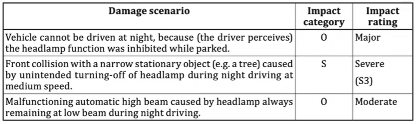

# TARA notes

## Asset identification
* Identify cybersecurity properties whose compromise leads to damage scenarios
* Identification of assets can be based on:
  * Analyzing the item definition
  * performing an impact rating
  * deriving assets from threat scenarios
  * using predefined catalogues
* Define the **asset (what), property (why)** of the asset and the **location (where)**
* Example:
  * **Asset**: Data Communication of braking function
  * **Cybersecurity property**: Integrity (part of CIA)
  * **Damage Scenario**: Collision with vehicle caused by unintented full braking.
.png)
* Property (why)
  * **Confidentiality**: Disclosure of information generally = _Privacy. People should not have access to things they don't_
  * **Integrity**: Data accuracy and completness generally = _Accuracy_
  * **Availability**: On-demand access to resources
  * **Non-Repudtiation**: Denial of action taken or failure to acknowledge request
  * **Authenticity**: Entity identity
  * **Accountability**: system state history (eg; audit)
  * **Authorization**: entity privilege
* Layer considerations (where):
  * **Physical layer**: hardware interface
  * **Network layer**: system-mediated transport
  * **Protocol**: custom data transport
  * **Application**: data handling within executables
  * _Example: a DoS attack is possible at all layers but handled differently at different layers._

## Threat Identification
### Threat modeling
* Step by step procedure to identify threats and vulnerabilities
  1. Identify assets
  2. Create an architectural overview including dataflows
  3. Identify threats, vulnerabilities and requirements
* Methods of thread modeling:
  * Attack tree
  * STRIDE Methodology
### Attack Tree method
* Quantitative method of doing your analysis
Local, remote, proximity (bluetooth, wifi, etc)  

* At the root of the tree is the **security goal**
  * Identify all possible attack goals
  * Think of all attacks against each goal
  * Add to tree

#### CVSS
* Common Vulnerability Scoring System
* Feasibility determined on exploitability metrics according to ISO 21434
  * Attack vector
  * Attack complexity
  * Privileges required
  * User interaction 

### STRIDE methodology
* STRIDE stands for Spoofing, Tampering, Repudiation, Information disclosure, Denial of Service, Elevation of Privilege
* This is a qualitative method of doing your analysis.

## Impact rating
An estimate of magnitude of damage or physical harm from a damage scenario (defined as consequence involving the vehicle and its function to a _road user_).  
* 4 categories for impact:
  * **Safety**
    * S0: No Injury = Neg: Negligible
    * S1: Light Injury = Mod: Moderate
    * S2: Severe Injury = Ser: Serious
    * S3: Life Threatening = Sev: Severe
  * **Financial**
    * F0: Negligible Losses = Neg: Negligible
    * F1: Moderate Losses = Mod: Moderate
    * F2: Substantial Losses = Ser: Serious
    * F3: Personal Bankruptcy = Sev: Severe
  * **Operational**
    * O0: Neglgible Disturbance = Neg: Negligible
    * O1: Vehicle mostly operational = Mod: Moderate
    * O2: Serious Limitation in Vehicle operation = Ser: Serious
    * O3: Vehicle not operational = Sev: Severe
  * **Privacy**
    * P0: Few Inconveniences = Neg: Negligible
    * P1: Significant Inconveniences = Mod: Moderate
    * P2: Serious Impact on PII = Ser: Serious
    * P3: Irreversible impact on PII = Sev: Severe
* Also known as SFOP.  
Eg:  

## Example

## Classic kill chain model example:
