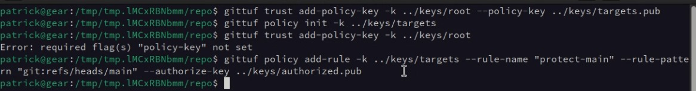
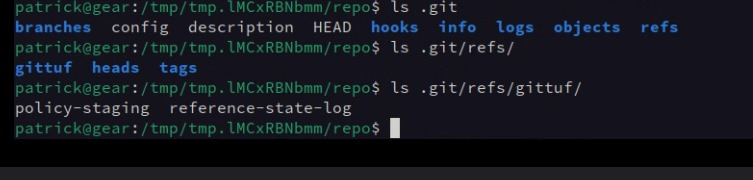
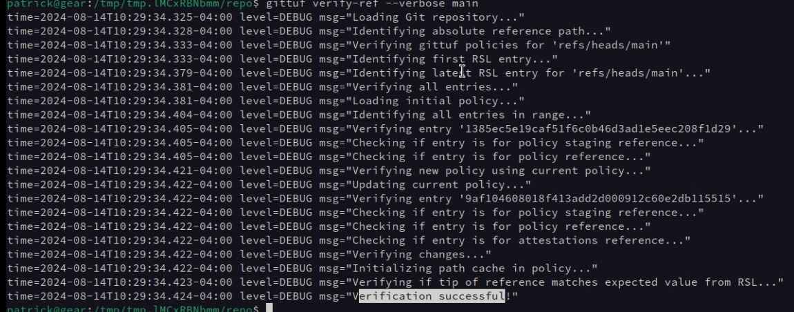

# gittuf code walkthrough

* using a common go cli package, `cobra`
* internal folder because no public api
* check repository/targets.go line 113

## what does each package do
* attestations
    * implements attestations
* cmd
    * all gittuf cli commands
* common
    * basic stuff everyone uses (boring)
* dev
    * alpha of alpha
* display
* git-remote-gittuf
    * most people are not going to care about what the policy says
    * this is automating the entire process, without touching gittuf
    * what the end user will use
    * very very alpha state
    * one area where they need help (eyes and hands)
* gitinterface
    * check out plumming and porcelain
    * if you wanna work on the git side of things, should be familiar with plumming (low level commands)
* policy
    * **interesting stuff**
    * deals with everything that mutates the policy
    * look @ `LoadState`
* repository
    * repository level stuff
* rsl
    * magic within rsl - new annotation, etc
* signerverifier
    * interface for can i sign with this key? can i verify with this key?
    * related to the securesystemslib
* testartifacts
    * testing data
* third_party
    * custom stuff?
* tuf
    * gittuf's implementatino of tuf
       

Patrick's suggestion:

## gittuf demo:

