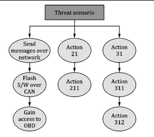
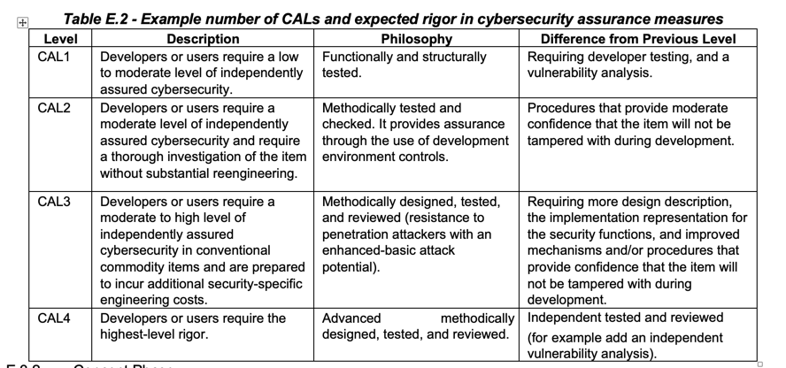

# notes from ISO 21434

> SYNOPSIS
> First of all, item identification is of utmost importance
## Risk Assessment Methods (Section 8 in the document)
Assets with cybersecurity properties whose compromise leads to a damage scenario shall be enumerated.
- Enumeration of assets can be done using **impact rating** and **deriving assets from threat scenarios**
- eg: 
  - **asset**: personal information (customer personal preferences) stored in an infotainment system 
  - **cybersecurity property**: confidentiality.
  - **damage scenario**:disclosure of the personal information without the customer’s consent resulting from the loss of confidentiality. 

Top Down Approaches include attack trees, attack graphs, etc

eg: 
- Threat Scenario: Spoofing of CAN (Controller Area Network) messages for the braking ECU (Electronic Control Unit), causing uncontrollable arbitrary braking of the vehicle leading to loss of passenger safety causing physical harm to the vehicle user.
-	Attack Path: The telematics ECU is compromised via the cellular interface, then Gateway ECU is compromised via CAN communication, next the gateway ECU forwards malicious torque request signals, resulting in spoofing of acceleration torque requests

For each attack path, the feasibility rating will be one of high, medium, low, very low.  
Attack potential will be determined based on one of the following:
- attack potential-based approach
- CVSS based approach
- attack-vector based approach 

After item definition, the following information needs to be identified:
- item boundary
- function
- preliminary architecture: this can include
  -	data flow with other objects outside of the item;
  -	physical aspects; and
  -	logical aspects.

The relevant surrounding operational information wrt cybersecurity shall be described - example: identification of the threat. Constraints and compliances must be justified  
Assumptions about the item's operational environment must be identifed. For example, some attacks may just not be feasible considering the operational environment of the item (since it may be kept in an anti-theft box)

## Generating CALs
CAL stands for Cybersecurity Assurance Levels. It is a classification scheme that can be used to help provide assurance that the assets of an item or component are adequately protected against the relevant threat scenarios.  
