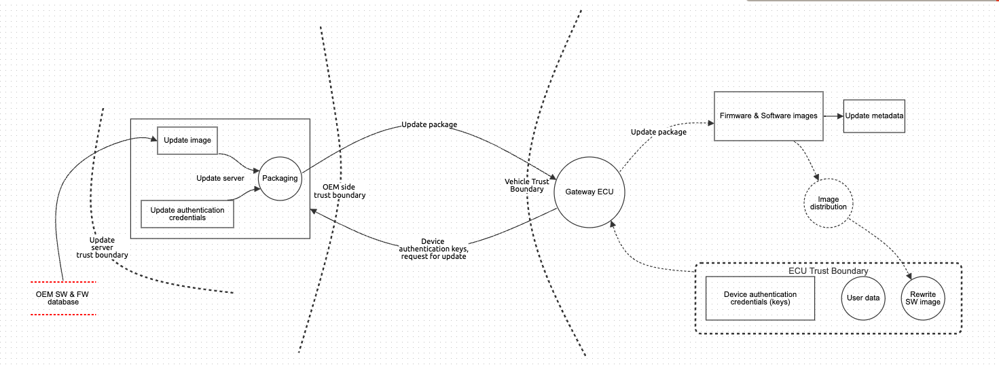
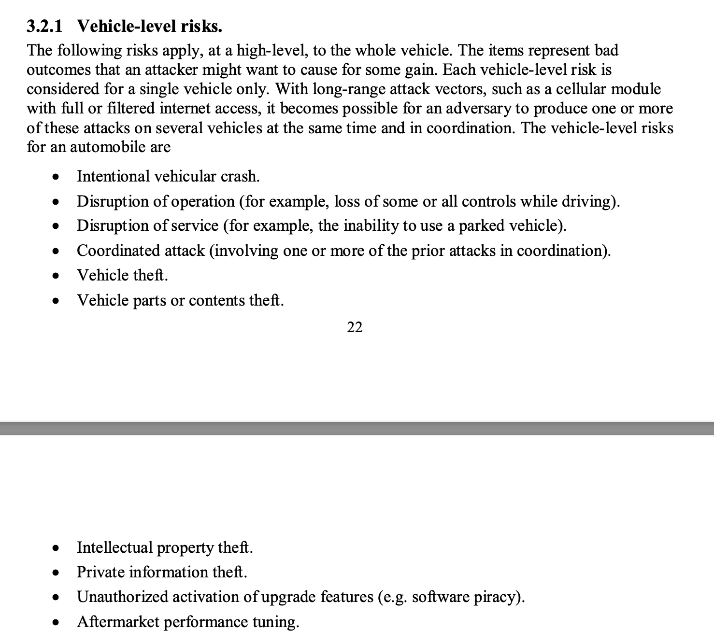

# questions and notes on threat modeling for Uptane

  
Current system diagram.

## Questions
1. How do I add the threat that a malicious software bundle poses when the WRONG package is installed on the wrong ECU?
    * Whose responsibility is that? image distribution software? If yes, how will that be tampered with if it isn't on the public network?
2. Can we decide a timeline for the threat modeling?
3. Define vehicle-level risks as done in [NHTSA document](https://www.nhtsa.gov/sites/nhtsa.gov/files/documents/cybersecurity_of_firmware_updates_oct2020.pdf).